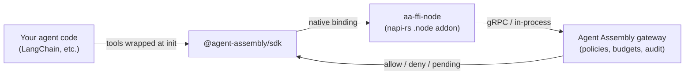
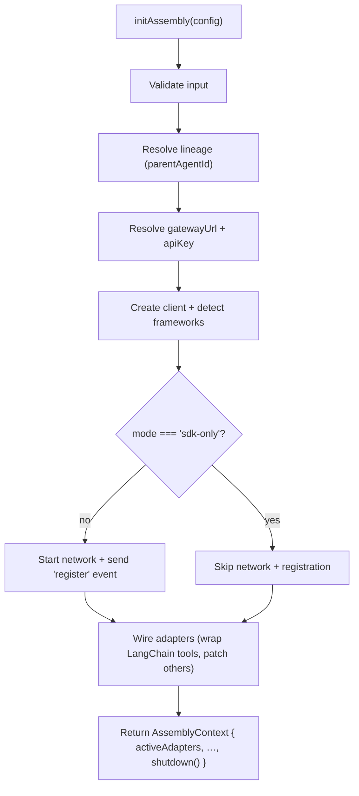

# Core Concepts

This section explains the moving parts behind `@agent-assembly/sdk` — enough to
understand *why* a tool call gets governed, where the native binding fits, and what
`initAssembly()` does on your behalf. For the file-level detail (the napi-rs crate,
the dual-build pipeline) see **[Architecture](./architecture.md)**.

## The big picture



You call `initAssembly(...)` once. From then on, the tools you handed it are wrapped
so the gateway client you configured decides a call before it executes. The path drawn
above is the one a client that reaches the gateway takes; the client this SDK falls back
to when you supply none answers in-process and allows everything.

The gateway, the policy engine, and the audit trail live in the core runtime. For the
platform-level picture — how the gateway renders decisions and how this SDK relates to
the sidecar-proxy and eBPF layers — see the core
[Architecture](https://docs.agent-assembly.com/core/latest/architecture/) and
[Security Model](https://docs.agent-assembly.com/core/latest/security/overview.html) docs.

## The napi-rs native FFI

The SDK does not re-implement governance in TypeScript. The actual transport to the
gateway runs through **`aa-ffi-node`** — a Rust crate compiled by
[napi-rs](https://napi.rs/) into a per-platform `.node` binary that the TypeScript
layer loads at runtime. This is the **in-process** interception path: the fastest of
Agent Assembly's three layers (SDK → sidecar proxy → eBPF), and the one you opt into
by adopting this SDK.

For most consumers the binary arrives prebuilt: four `@agent-assembly/runtime-*`
packages (`linux-x64`, `linux-arm64`, `darwin-x64`, `darwin-arm64`) are declared as
`optionalDependencies`, and npm installs only the one matching your host. Windows has
no prebuild and builds from source. See [Architecture](./architecture.md#napi-rs-ffi-layer)
for the load path and [Troubleshooting](../08-troubleshooting/index.md) for rebuilds.

## The AdapterRegistry

Every supported framework is integrated through an object that satisfies the
`Adapter` interface (`src/adapters/adapter.ts`). At `initAssembly()` time the detected
adapters are added to an `AdapterRegistry` (`src/adapters/adapter-registry.ts`), and
`applyAll()` activates each one's framework-specific hooks. This is how a single
`initAssembly()` call can wrap LangChain tools, patch the Vercel AI SDK, and so on,
without you wiring each framework by hand. The adapters whose patch was applied and is
reachable for a given run are returned to you as `ctx.activeAdapters`. Detection alone is
not enough to appear there: a framework that is installed but whose patch failed, was
inert, or had nothing to attach to is reported in `ctx.unpatchedAdapters` instead, and
this SDK neither observes nor governs it.

Membership in `ctx.activeAdapters` is a statement about **mechanism, not enforcement**.
It says a patch was applied — it does not say a policy DENY will block a call. LangGraph
and Mastra are lineage-tagging only, the LangChain callback layer is audit-only, and even
the genuinely enforcing paths degrade to a non-blocking check outside a check-capable
mode. See [Guides → Other frameworks](../04-guides/index.md#other-frameworks-experimental-auto-detected)
for the per-framework capability table.

## The `initAssembly` lifecycle

`initAssembly(config)` is the front door. It validates input, resolves where the
gateway is, builds a client, detects frameworks, registers the agent (unless you opt
out), wires the adapters, and hands you back an `AssemblyContext` with a `shutdown()`
method.



The step-by-step breakdown, including exactly what gets validated and the registration
payload, lives in **[Configuration → The init flow](../05-configuration/index.md#the-init-flow)**.

`AssemblyContext` (`src/types/assembly-context.ts`) is what you get back:

```ts
interface AssemblyContext {
  /** Patch applied and reachable. NOT an enforcement guarantee — see above. */
  readonly activeAdapters: readonly string[];
  /** Found installed. NOT a superset of activeAdapters (see the note below). */
  readonly detectedAdapters: readonly string[];
  /** Detected but not attached — patch failed, was inert, skipped, or unreachable. */
  readonly unpatchedAdapters: readonly string[];
  readonly parentAgentId?: string;
  readonly teamId?: string;
  readonly delegationReason?: string;
  readonly spawnedByTool?: string;
  readonly enforcementMode?: EnforcementMode;
  shutdown: () => Promise<void>;
}
```

:::caution[`activeAdapters` is not a subset of `detectedAdapters`]
A framework you configure **explicitly** is active without ever being detected. Today
that is `langchain-js` only: passing a `langchain` config wires the adapter up even when
`@langchain/core` does not resolve on disk. So with an explicit `langchain` config and an
inert `ai` install you can see `active: ["langchain-js"]` alongside
`detected: ["vercel-ai-sdk"]` — an empty intersection.

Do not compute "the governed frameworks" as `detected.filter(d => active.includes(d))`;
that silently drops the one adapter that is genuinely wrapped. Read `activeAdapters`
directly. The invariant that does hold is
`unpatchedAdapters === detectedAdapters \ activeAdapters`.
:::

Always `await ctx.shutdown()` when your agent is done — it tears down the adapters and
the gateway client.

## Modes and enforcement

Two enum-typed fields shape how the SDK behaves. Both are fully detailed in
[Configuration](../05-configuration/index.md), summarized here:

- **`AssemblyMode`** (`"auto" | "sdk-only" | "grpc-sidecar" | "napi-inprocess"`) —
  *how* the SDK reaches the runtime. `"auto"` (the default) currently selects the gRPC
  sidecar transport; `"sdk-only"` skips the network and registration entirely
  (in-process bookkeeping only — useful in tests).
- **`EnforcementMode`** (`"enforce" | "observe" | "disabled"`) — the governance
  *posture* sent at registration. `"enforce"` blocks denied actions; `"observe"` is a
  dry-run that lets everything through but records would-be violations; `"disabled"`
  skips policy evaluation (hermetic tests only). The runtime-checkable list is exported
  as `ENFORCEMENT_MODES`.

## Dual ESM / CJS packaging

A single TypeScript source is compiled into both ECMAScript-Modules and CommonJS
outputs, and the package's `exports` map routes `import` to `dist/esm/` and `require`
to `dist/cjs/`. You generally do not need to think about this — both
`import { initAssembly } from "@agent-assembly/sdk"` and
`require("@agent-assembly/sdk")` resolve correctly. The mechanics are in
[Architecture → Dual ESM / CJS](./architecture.md#dual-esm--cjs-package-structure).
