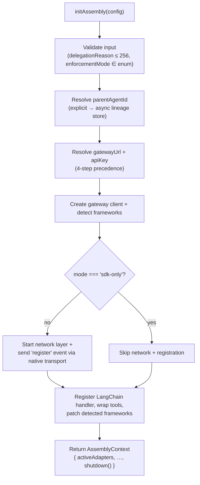

# Configuration

Everything the SDK does starts at `initAssembly(config)`. The `config` argument is
optional — `initAssembly()` with no arguments is a supported, zero-config call that
discovers a local gateway automatically. This page documents the full
[`AssemblyConfig`](../06-api-reference/index.md) surface and the order in which `initAssembly()`
applies it.

## The init flow

When you call `initAssembly(config)`, the SDK runs these steps in order:



1. **Validation.** `delegationReason` longer than 256 characters throws a `RangeError`;
   an `enforcementMode` outside the allowed set throws a `RangeError`. These run before
   any network activity so a misconfigured call fails fast.
2. **Lineage resolution.** `parentAgentId` defaults to the current agent id from the
   async-context lineage store, so child agents spawned inside framework hooks inherit
   lineage automatically.
3. **Gateway resolution.** `gatewayUrl` and `apiKey` are resolved through the precedence
   chain below.
4. **Client + framework detection.** A gateway client is created and installed
   frameworks are detected from the consumer's `node_modules`.
5. **Network + registration.** Unless `mode` is `"sdk-only"`, the network layer starts
   and a `register` topology event is sent through the native transport.
6. **Adapter wiring.** The LangChain callback handler is registered, configured LangChain
   tools are wrapped, and any other detected framework (Vercel AI SDK, OpenAI Agents,
   LangGraph, Mastra) is patched.
7. **Return.** An `AssemblyContext` is returned with the list of `activeAdapters`, any
   echoed lineage fields, and an async `shutdown()` that tears down adapters and clients.

## Gateway URL & API key resolution

Both `gatewayUrl` and `apiKey` are resolved with the same four-step precedence
(highest first). The first source that yields a value wins:

| Priority | Source                            | URL key                                                  | API-key key                                      |
| -------- | --------------------------------- | -------------------------------------------------------- | ------------------------------------------------ |
| 1        | Explicit field on `config`        | `gatewayUrl`                                             | `apiKey`                                         |
| 2        | Environment variable              | `AAASM_GATEWAY_URL`                                      | `AAASM_API_KEY`                                  |
| 3        | Config file `~/.aasm/config.yaml` | `agent.gateway_url`                                      | `agent.api_key`                                  |
| 4        | Local default                     | `http://localhost:7391` (probed; auto-started if absent) | `""` (local mode accepts unauthenticated agents) |

The config file is optional and parsed only when the `js-yaml` soft dependency is
present; a missing file, missing `js-yaml`, or malformed contents are treated as
"no value" rather than an error:

```yaml
# ~/.aasm/config.yaml
agent:
  gateway_url: "https://gateway.internal:7391"
  api_key: "k-xxxxxxxx"
```

When resolution reaches step 4, the SDK probes `http://localhost:7391/healthz`. If
nothing responds, it attempts to auto-start a local gateway by running
`aasm start --mode local --foreground` (the `aasm` binary must be on `PATH` — install it
with `brew install ai-agent-assembly/tap/aasm`). A `ConfigurationError` is thrown when `aasm`
is missing, and a `GatewayError` when the auto-started gateway does not become healthy in
time. See [Troubleshooting](../08-troubleshooting/index.md) for the recovery paths.

The `aasm` binary and the gateway it starts are part of the core runtime. For the full
list of gateway subcommands and flags, see the core
[CLI Reference](https://docs.agent-assembly.com/core/latest/cli/overview.html).

## `AssemblyConfig` fields

| Field              | Type                     | Default                       | Purpose                                                                                         |
| ------------------ | ------------------------ | ----------------------------- | ----------------------------------------------------------------------------------------------- |
| `gatewayUrl`       | `string`                 | resolved (see above)          | Base URL of the Agent Assembly gateway.                                                         |
| `apiKey`           | `string`                 | resolved (see above)          | Credential for the gateway; empty in local mode.                                                |
| `agentId`          | `string`                 | _none_                        | Stable identifier for this agent.                                                               |
| `mode`             | `AssemblyMode`           | `"auto"`                      | Transport selection (see below).                                                                |
| `enforcementMode`  | `EnforcementMode`        | gateway default (`"enforce"`) | Per-agent governance posture sent at registration (see below).                                  |
| `parentAgentId`    | `string`                 | async-lineage value           | Parent agent that delegated to this one.                                                        |
| `teamId`           | `string`                 | _none_                        | Team for budget and policy scoping.                                                             |
| `delegationReason` | `string`                 | _none_                        | Why this agent was delegated to; **must be ≤ 256 chars** or `initAssembly` throws `RangeError`. |
| `spawnedByTool`    | `string`                 | _none_                        | Name of the tool that spawned this agent.                                                       |
| `langchain`        | `LangChainAdapterConfig` | _none_                        | LangChain callbacks/tools/approval timeout.                                                     |
| `gatewayClient`    | `GatewayClient`          | created internally            | Inject a pre-built client (mainly for tests).                                                   |

### `mode`

`AssemblyMode` selects how the SDK reaches the runtime:

| Value              | Behavior                                                                  |
| ------------------ | ------------------------------------------------------------------------- |
| `"auto"`           | Default. Selects the transport automatically; currently the gRPC sidecar. |
| `"sdk-only"`       | No network layer and no registration event — in-process bookkeeping only. |
| `"grpc-sidecar"`   | Talk to a separate gateway process over gRPC.                             |
| `"napi-inprocess"` | Use the in-process napi-rs binding.                                       |

### `enforcementMode`

`EnforcementMode` mirrors the core runtime's posture. When omitted, the field is left off
the registration payload and the gateway applies its server-side default (`"enforce"`),
preserving the pre-feature wire shape.

| Value        | Behavior                                                                                                                  |
| ------------ | ------------------------------------------------------------------------------------------------------------------------- |
| `"enforce"`  | Default. Deny blocks the action; redact strips secrets.                                                                   |
| `"observe"`  | Dry-run. Every action proceeds; would-be violations are recorded as shadow audit events (`aa audit list --dry-run-only`). |
| `"disabled"` | Policy evaluation skipped entirely. Hermetic tests only.                                                                  |

Unknown values throw a `RangeError` so a typo can never silently downgrade an agent into
live enforcement when the operator meant `observe`.

## Examples

Zero-config — discover (and if needed auto-start) a local gateway:

```ts
import { initAssembly } from "@agent-assembly/sdk";

const ctx = await initAssembly();
// ... run your agent ...
await ctx.shutdown();
```

Explicit, with lineage and a dry-run posture:

```ts
const ctx = await initAssembly({
  gatewayUrl: "https://gateway.internal:7391",
  apiKey: process.env.AAASM_API_KEY,
  agentId: "research-agent",
  teamId: "growth",
  enforcementMode: "observe",
  delegationReason: "summarize quarterly metrics"
});
```

See [Guides](../04-guides/index.md) for full framework-integration walkthroughs.
